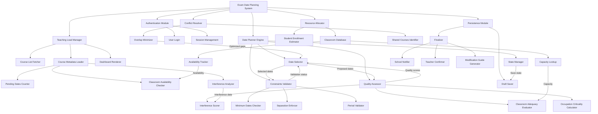

# Planificazione delle date di esami alla Scuola di Ingegneria
## un esercizio di progettazione e programmazione strutturata – EV: Giugno ‘25

Nell’organizzazione dell’offerta didattica della Scuola di Ingegneria, ciascun docente deve pianificare in anticipo le date degli esami nel corso dell’anno.

La pianificazione è soggetta ad alcuni vincoli:

- Devono essere pianificate (almeno) 7 date nel corso dell’anno
- Collocate entro periodi destinati agli esami (durante i quali non ci sono lezioni)
- Distanziate di almeno 14 giorni una dall’altra
- Opportuno mitigare la sovrapposizione con esami di insegnamenti condivisi dagli stessi studenti  
  *(es. ingegneria del sw e basi di dati per ingegneria informatica III anno)*  
  *(mitigazione = distanza minima 3-5 giorni tra date conflittuali)*

**Vincolo aggiuntivo per esami in aula**:
- Data fissabile solo in giorni con aula:
  - Libera
  - Adeguata capienza al numero atteso di candidati  
  *(numero determinabile automaticamente dalla numerosità dei corsi di laurea)*

---

### Flusso del caso d'uso (interfaccia docente):
1. **Autenticazione**: 
   - Docente visualizza gli insegnamenti da pianificare
   - Per ciascun insegnamento:
     - Numero di date ancora da pianificare
     - Giorni con aule disponibili
     - Grado di interferenza con esami correlati

2. **Pianificazione iterativa**:
   - Docente seleziona ripetutamente date per ogni insegnamento
   - Ad ogni selezione:
     - Notifica se:
       - Date totali < 7 
       - Date non distanziate ≥14 giorni
     - Indicazione qualità per ogni data:
       - Sovrapposizione con altri esami correlati
       - Sottodimensionamento aula
       - Criticità occupazione aule

3. **Conclusione**:
   - Continua finché:
     - Vincoli necessari soddisfatti + docente consolida **OPPURE**
     - Docente salva soluzione intermedia (anche imperfetta)
   - Date salvate e trasmesse a:
     - Scuola (pianificazione ufficiale)
     - Docente (promemoria con istruzioni modifica)

